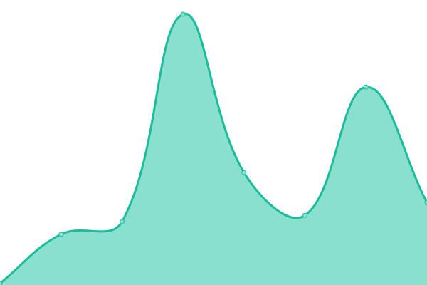

# [📈 Live Status](https://upptime.github.io/upptime): <!--live status--> **🟩 All systems operational**

This repository contains the open-source uptime monitor and status page for Filadeus, powered by [Upptime](https://github.com/upptime/upptime).

With [Upptime](https://upptime.js.org), you can get your own unlimited and free uptime monitor and status page, powered entirely by a GitHub repository. We use [Issues](https://github.com/upptime/upptime/issues) as incident reports, [Actions](https://github.com/Filadeus/filadeus-upptime/actions) as uptime monitors, and [Pages](https://upptime.github.io/upptime) for the status page.

<!--start: status pages-->
<!-- This summary is generated by Upptime (https://github.com/upptime/upptime) -->
<!-- Do not edit this manually, your changes will be overwritten -->
<!-- prettier-ignore -->
| URL | Status | History | Response Time | Uptime |
| --- | ------ | ------- | ------------- | ------ |
|  [Munin](https://munin.efimio.ru) | 🟩 Up | [munin.yml](https://github.com/Filadeus/filadeus-upptime/commits/HEAD/history/munin.yml) | 

 972ms
     
 | 

<a href="https://Filadeus.github.io/filadeus-upptime/history/munin">89.08%</a>
    

|  [PVE](https://pve-01.efimio.ru) | 🟩 Up | [pve.yml](https://github.com/Filadeus/filadeus-upptime/commits/HEAD/history/pve.yml) | 

 841ms
     
 | 

<a href="https://Filadeus.github.io/filadeus-upptime/history/pve">89.09%</a>
    

|  [Gitea](https://git.efimio.ru) | 🟩 Up | [gitea.yml](https://github.com/Filadeus/filadeus-upptime/commits/HEAD/history/gitea.yml) | 

 912ms
     
 | 

<a href="https://Filadeus.github.io/filadeus-upptime/history/gitea">89.09%</a>
    

|  [Nextcloud](https://nextcloud.efimio.ru/) | 🟩 Up | [nextcloud.yml](https://github.com/Filadeus/filadeus-upptime/commits/HEAD/history/nextcloud.yml) | 

 1698ms
     
 | 

<a href="https://Filadeus.github.io/filadeus-upptime/history/nextcloud">89.10%</a>
    

<!--end: status pages-->

[**Visit our status website →**](https://upptime.github.io/upptime)

## 📄 License

- Powered by: [Upptime](https://github.com/upptime/upptime)
- Code: [MIT](./LICENSE) © [Upptime](https://upptime.js.org)
- Data in the `./history` directory: [Open Database License](https://opendatacommons.org/licenses/odbl/1-0/)
